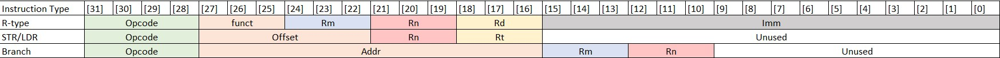
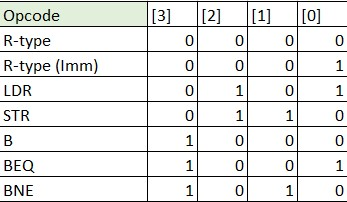
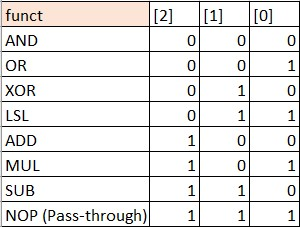

# Custom RISC-Based CPU (WIP)

This repository contains an RTL implementation of a custom RISC-based CPU. The CPU operates with 32-bit instructions and using 16-bit words.

## Learning Goals

The intent of this project is to familiarize myself with basic computer architecture, designing and architecting a system from scratch, and implementing complex designs involving integrating modules and control.

The end goal for this project is to create a synthesizable design on an FPGA target that can load a memory initialization file to run as an executable.

## Design Details

The CPU contains 8 general purpose data registers, 2 kB of data memory, and 4 kB of instruction memory.

The CPU is separated into five stages: instruction fetch (IF), instruction decode (ID), execute (EX), memory access (MEM), and write back (WB). 

The following instruction types are supported: R-type (ALU and logic operations), LDR and STR, and branch instructions. Their behaviour and operands are structured similarly to ARM Assembly instructions.

Below screenshots show the custom ISA used to implement the CPU:

